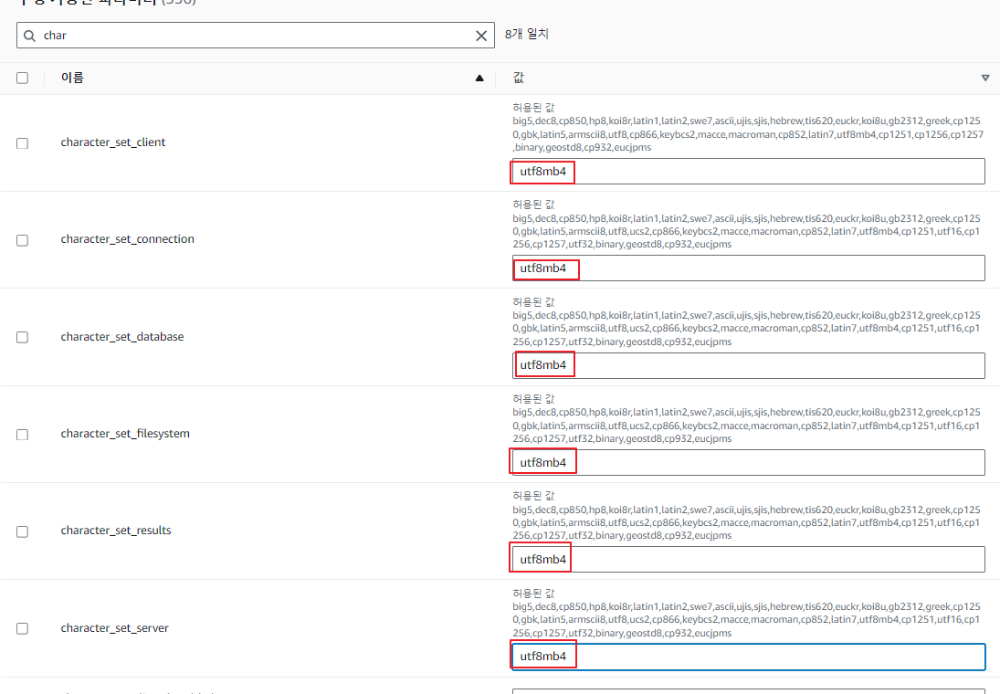
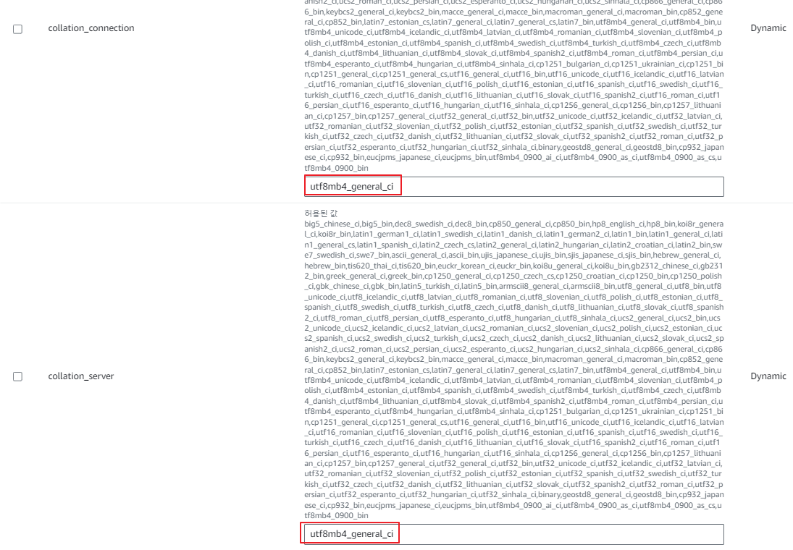
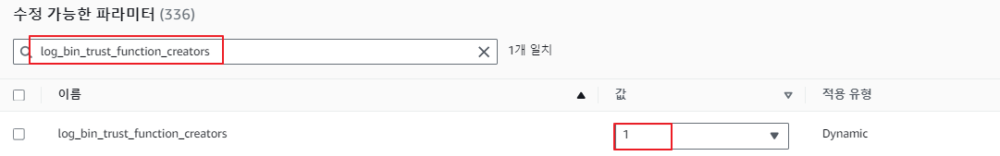
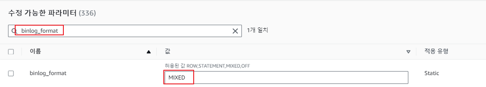
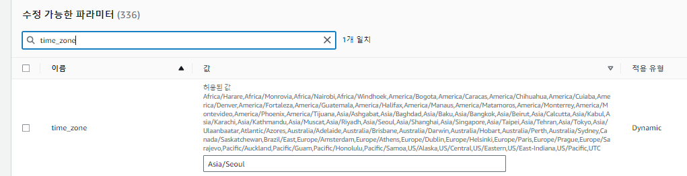

### create 3az-s3gw-vpc
```bash
aws cloudformation create-stack --stack-name vpc-stack --template-body file://vpc.yml --capabilities CAPABILITY_IAM
```

### bastion
```bash
#!/bin/bash
sed -i 's/PasswordAuthentication no/PasswordAuthentication yes/g' /etc/ssh/sshd_config
sed -i 's/#Port 22/Port 2024/g' /etc/ssh/sshd_config
echo 'password' | passwd --stdin ec2-user
systemctl restart sshd
```

### install package
```
yum install go -y
curl "https://awscli.amazonaws.com/awscli-exe-linux-aarch64.zip" -o "awscliv2.zip"
unzip awscliv2.zip
sudo ./aws/install
```

### Parameters Group







### install mariadb105
```bash
sudo yum install mariadb105 -y
mysql -p product -P 3030 -h database-1.cluster-c6xikmepqgwm.ap-northeast-2.rds.amazonaws.com -u admin
```
create table
```sql
CREATE TABLE product (
    id VARCHAR(255) PRIMARY KEY,
    category VARCHAR(255),
    price VARCHAR(255)
);
```

### API test
```bash
curl -X POST -H "Content-Type: application/json" -d '{"id": "1","category": "book","price": "1000"}' localhost:8080/v1/product
curl localhost:8080/v1/product?id=1
```

### create Dockerfile
```bash
# Build stage
FROM arm64v8/golang:1.18.2-alpine AS build

WORKDIR /source

COPY main.go .

RUN go mod init example.com/m/v2 \
 && go get github.com/gin-gonic/gin \
 && go get github.com/go-sql-driver/mysql \
 && go get "github.com/aws/aws-sdk-go/aws" \
 && go get "github.com/aws/aws-sdk-go/aws/session" \
 && go get "github.com/aws/aws-sdk-go/service/secretsmanager" \
 && go build -o ./main

# Runtime stage
FROM arm64v8/alpine

WORKDIR /app

COPY --from=build /source/main ./

RUN adduser --disabled-password app

RUN apk add --no-cache gcompat && apk add --no-cache libc6-compat && apk add --no-cache curl && chmod +x ./main && chown app /app
USER app

ENTRYPOINT ["./main", "-secretName", "product-secret-rds"]
```